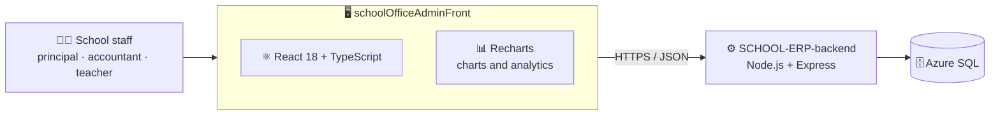

<p align="center">
  
</p>

<p align="center">
  
  
  
  
  <a href="https://www.schooloffice.tech"></a>
</p>

## 🏫 About

This is the **admin panel (frontend)** of **[School Office](https://www.schooloffice.tech)**, a school management ERP for K-12 schools. It is a single-page app built with **React and TypeScript**, with charts powered by **Recharts**. School staff use it to manage school data, and it talks to the **[SCHOOL-ERP-backend](https://github.com/Muniramm890/SCHOOL-ERP-backend)** REST API.

## 🧱 How it fits together



## 🧰 Tech stack

| Layer | Technology | Used for |
| :-- | :-- | :-- |
| UI | React 18.2 | Component-based interface |
| Language | TypeScript | Type-safe code |
| Charts | Recharts 3 | Charts and analytics views |
| Tooling | Create React App (`react-scripts` 5) | Dev server, build and tests |
| Backend | [SCHOOL-ERP-backend](https://github.com/Muniramm890/SCHOOL-ERP-backend) | REST API and database access |

## 📁 Project structure

```text
schoolOfficeAdminFront/
├── public/            # Static files and the HTML template
├── src/
│   ├── index.tsx      # Application entry point
│   ├── App.tsx        # Main application component
│   └── …              # Remaining application source
├── package.json       # Scripts and dependencies
├── tsconfig.json      # TypeScript configuration
└── README.md
```

## 🚀 Getting started

**Requirements:** Node.js (18 or newer recommended) and npm.

```bash
# 1. Clone
git clone https://github.com/Muniramm890/schoolOfficeAdminFront.git
cd schoolOfficeAdminFront

# 2. Install dependencies
npm install

# 3. Start the development server (http://localhost:3000)
npm start
```

The admin panel needs the backend running, so start **[SCHOOL-ERP-backend](https://github.com/Muniramm890/SCHOOL-ERP-backend)** first and make sure the panel points to its API address.

| Script | What it does |
| :-- | :-- |
| `npm start` | Runs the app in development mode on port 3000 |
| `npm run build` | Creates an optimised production build in `build/` |
| `npm test` | Runs the test runner |
| `npm run eject` | Ejects from Create React App (one-way) |

<!--
## 📸 Screenshots
Add screenshots to a docs/screenshots folder and show them here:

| Dashboard | Students |
| :-: | :-: |
|  |  |
-->

## 🔗 Related repositories

| Repository | Purpose |
| :-- | :-- |
| [SCHOOL-ERP-backend](https://github.com/Muniramm890/SCHOOL-ERP-backend) | Node.js backend and REST API |
| [SchoolOffice](https://github.com/Muniramm890/SchoolOffice) | Product website |

## 📬 Contact

- 🌐 Website: [schooloffice.tech](https://www.schooloffice.tech)
- 📧 Email: [Head@schooloffice.tech](mailto:Head@schooloffice.tech)
- 👤 Developer: [Muni Ram Meena](https://github.com/Muniramm890)

<p align="center">
  
</p>
